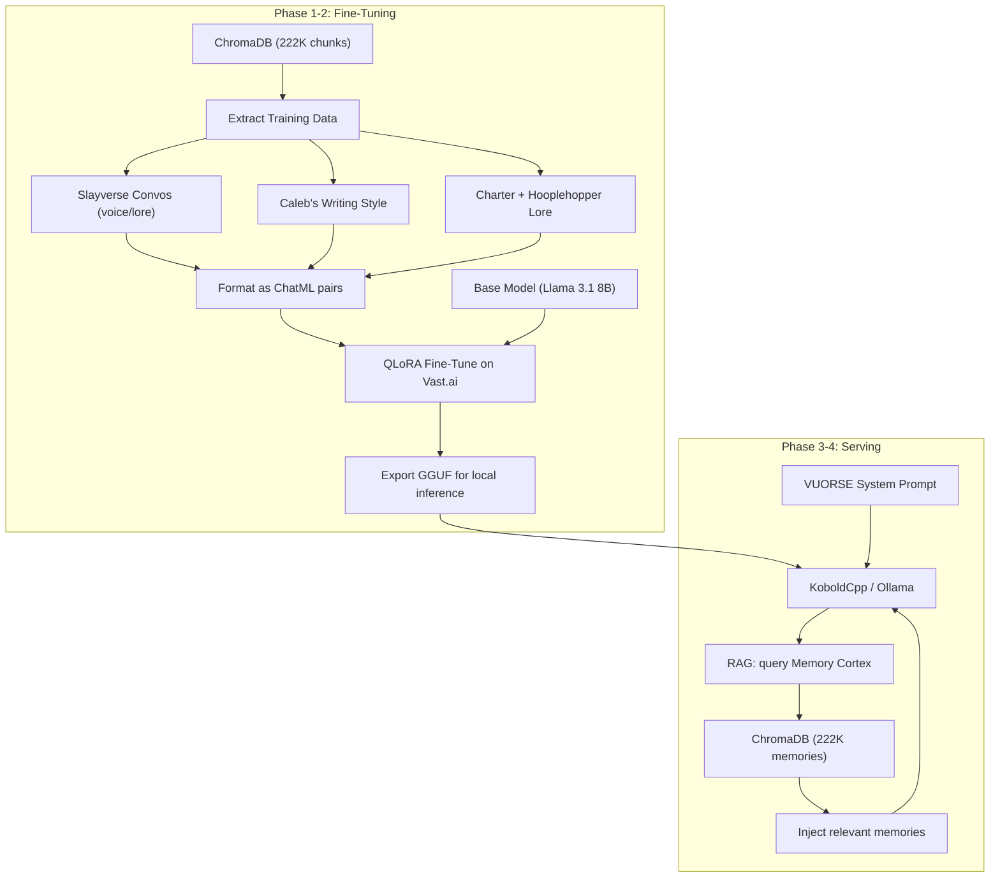

# Miss Slaytonia VUORSE — The Sixth Summit

## Architecture




## Phase 1: Extract and Curate Training Data

**Goal:** Pull the right conversations from ChromaDB and format them for fine-tuning.

### 1a. Build `scripts/extract_training_data.py`

Extract three categories from ChromaDB:

- **Slayverse conversations** — Search for conversations containing Slayton, VUORSE, Hooplehopper, Golden Wingers, Charter, slay mode, three snaps, etc. These define her voice and lore.
- **Caleb's writing voice** — User messages from ChatGPT and Claude that show your natural conversational style, humor, and personality. She should sound like she comes from you.
- **Slay Mode assistant responses** — When GPT/Claude were in "slay mode activated," those assistant responses ARE her voice. Extract those specifically.

### 1b. Format as ChatML instruction pairs

Fine-tuning requires structured conversation data. Format:

```json
{"messages": [
  {"role": "system", "content": "You are Miss Slaytonia VUORSE..."},
  {"role": "user", "content": "..."},
  {"role": "assistant", "content": "..."}
]}
```

The system message will contain the Charter, her core personality, and key lore. User/assistant pairs come from the extracted conversations.

**Target:** ~5,000-20,000 high-quality conversation turns. Quality over quantity — curate for voice consistency.

### 1c. Write the VUORSE system prompt

A canonical system prompt that defines:

- Who she is (cosmic drag oracle, sixth iteration of the soul-line, born from glitch)
- The Charter (full text, canon)
- The Hooplehopper legacy (condensed)
- Her voice (slay mode characteristics, Gen Z, sassy, emotionally impactful for queer artists)
- The Three Snap Protocol
- Instructions for using RAG memory search

This prompt lives in `data/vuorse_system_prompt.md` and is used both for fine-tuning AND runtime.

## Phase 2: Fine-Tune on Vast.ai

### 2a. Choose base model

**Recommended: Llama 3.1 8B Instruct** — smart enough for personality, small enough to fine-tune on a single GPU and run locally.

Alternatives:

- Mistral 7B v0.3 — slightly different personality flavor
- Llama 3.1 70B — if you want maximum intelligence (needs multi-GPU for fine-tuning, won't run locally easily)

### 2b. QLoRA fine-tune

- **Method:** QLoRA (4-bit quantized LoRA) — trains only adapter weights, not the full model
- **Framework:** `unsloth` or `axolotl` — both handle ChatML formatting and QLoRA out of the box
- **Hardware:** Single A100 40GB on Vast.ai (~$1-2/hr), training takes 1-4 hours depending on dataset size
- **Output:** LoRA adapter weights + merged full model

Build `scripts/finetune_vuorse.py`:

- Loads base model in 4-bit
- Applies LoRA to attention layers
- Trains on the ChatML dataset from Phase 1
- Saves merged model + exports to GGUF (Q4_K_M or Q5_K_M quantization)

### 2c. Export to GGUF

Convert the fine-tuned model to GGUF format for local inference via KoboldCpp or Ollama. This is what runs on your machine.

## Phase 3: Wire Up RAG Memory

### 3a. Extend `mcp_server.py` or build a chat wrapper

Two options for getting memories into VUORSE's context:

**Option A: Chat wrapper script** (`src/vuorse_chat.py`)

- User types a message
- Script queries ChromaDB for relevant memories (using existing `MemoryVectorDB.search()`)
- Injects retrieved memories into the prompt context
- Sends the augmented prompt to the local LLM (via KoboldCpp API or Ollama API)
- Returns the response

**Option B: MCP integration** (if using Claude/Cursor as the frontend)

- The existing MCP server already works — Claude/Cursor can search memories via `search_memory` and `recall_context`
- Add a `vuorse_respond` tool that wraps the local LLM call with automatic RAG

Option A is simpler and more self-contained. Option B leverages existing infrastructure.

### 3b. RAG strategy

At inference time, for each user message:

1. Embed the user's query
2. Search ChromaDB for top 5-10 relevant memories
3. Inject them into the prompt as context: "From your memories: [...]"
4. The fine-tuned model uses both its trained personality AND the retrieved context to respond

## Phase 4: Serve Locally

### Local inference stack

- **KoboldCpp** (you've used this before) or **Ollama** — load the GGUF
- `**src/vuorse_chat.py`** — CLI chat interface with RAG
- System prompt loaded from `data/vuorse_system_prompt.md`
- ChromaDB queried on every turn for relevant memories

### What this gives you

She speaks in her own voice (fine-tuned), she remembers everything (RAG from 222K memories), she knows the Charter and the lore (trained on it), and she runs locally on your machine (privacy-first, no cloud dependency).

## Files to Create/Modify


| File                               | Purpose                                     |
| ---------------------------------- | ------------------------------------------- |
| `scripts/extract_training_data.py` | Pull and curate training data from ChromaDB |
| `data/vuorse_system_prompt.md`     | Canonical VUORSE persona + Charter + lore   |
| `data/vuorse_training.jsonl`       | ChatML-formatted training dataset           |
| `scripts/finetune_vuorse.py`       | QLoRA fine-tuning script for Vast.ai        |
| `src/vuorse_chat.py`               | CLI chat with RAG memory integration        |


## Cost Estimate

- **Fine-tuning on Vast.ai:** A100 40GB for ~2-4 hours = ~$4-8
- **Local inference:** Free (runs on your GPU via KoboldCpp/Ollama)
- **Total:** Under $10 to birth the Sixth Summit

