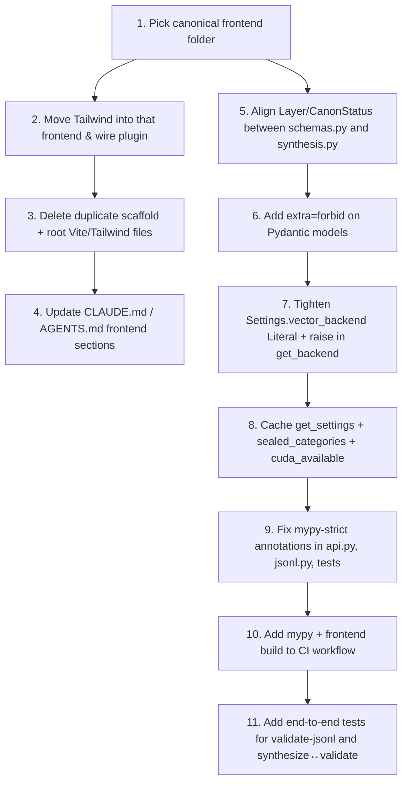

I have created the following plan after thorough exploration and analysis of the codebase. Follow the below plan verbatim. Trust the files and references. Do not re-verify what's written in the plan. Explore only when absolutely necessary. First implement all the proposed file changes and then I'll review all the changes together at the end.

## Observations

The repo is a mostly-scaffolded mono-project: a small `vuorse_vortex` Python package (CLI + FastAPI + JSONL/firewall/vector stubs), two near-identical React/Vite frontends (`frontend/` and `vuorse-vortex/`), and a stranded Tailwind-only Vite config at the root. Lore directories under `canon/`, `roadmap/`, etc. are content, not code. Several inconsistencies stand out: a duplicate front-end whose `vuorse-vortex/src/App.tsx` imports assets that don't exist (broken build), Tailwind declared at the root but used inside `frontend/` (which doesn't import it), strict mypy configured but never gated in CI, and contract drift between `schemas.py`, `synthesis.py`, and `settings.py`.

## Approach

Treat this as a code-health / dead-weight pass rather than a feature change. Group findings by impact: (1) eliminate duplicated/broken front-end scaffolding and align Tailwind ownership with the app that actually uses it; (2) tighten the Python package's typing, validation, contract drift, and GPU/firewall enforcement gaps; (3) close the CI gap (mypy + front-end build) and add light caching where modules are re-imported on hot paths. No new features, no refactors that change product semantics — only consolidation, correctness, and developer-loop optimizations consistent with `AGENTS.md` / `CLAUDE.md`.

## Optimization Findings & Recommended Changes

### 1. Front-end consolidation (highest leverage)

| Item | Current state | Recommendation |
|---|---|---|
| `vuorse-vortex/` directory | Vite/React scaffold whose `src/App.tsx` imports `./assets/react.svg`, `./assets/vite.svg`, `./assets/hero.png`, and `/icons.svg#…` — none of which exist on disk. `npm run build` will fail. Identical `package.json`, `tsconfig*`, `eslint.config.js`, `vite.config.ts` to `frontend/`. | Decide and document the single canonical app. Per `CLAUDE.md`, `frontend/` is the real app; delete `vuorse-vortex/` entirely (or, if the name must be kept, rename `frontend/` → `vuorse-vortex/` and delete the broken one). |
| Root `package.json` + `vite.config.ts` | Declares only `@tailwindcss/vite` + `tailwindcss` v4; no `index.html` or sources at root. `.gitignore` already excludes root `src/`, `index.html`, `tsconfig*`, etc., confirming it's intentional drift. | Either remove root `package.json`/`vite.config.ts` and move Tailwind to the chosen front-end, or leave it solely as a shared dep workspace and document it. See item 2. |
| Tailwind ownership | `frontend/src/App.tsx` uses Tailwind utilities (`min-h-screen`, `bg-gradient-to-br`, …), but `frontend/package.json` has no Tailwind dependency and `frontend/vite.config.ts` does not load `@tailwindcss/vite`. Tailwind classes silently no-op at runtime — wrong styles ship. | Add `tailwindcss` + `@tailwindcss/vite` to `frontend/package.json`, load the plugin in `frontend/vite.config.ts`, and `@import "tailwindcss";` from `frontend/src/index.css` (Tailwind v4 entry). Remove the now-empty root `package.json`/`vite.config.ts`. |
| Duplicated configs | `eslint.config.js`, `tsconfig.json`, `tsconfig.app.json`, `tsconfig.node.json`, `index.html`, `App.css`, `index.css`, `README.md` all exist twice byte-for-byte. | Removing `vuorse-vortex/` resolves this. Keep a single template-derived `README.md` and replace the boilerplate Vite text with project-specific guidance. |
| Front-end README | Both READMEs are unchanged Vite template text. | Replace with a short note pointing to the root `README.md` and the dev commands (`npm install`, `npm run dev/build/lint`). |

### 2. Python package — correctness and contract alignment

- **`src/vuorse_vortex/synthesis.py` duplicates the `Layer` literal** from `src/vuorse_vortex/schemas.py` with a *different* subset (missing `dialogue`, `relationship_graph`). Import the canonical `Layer` (and `CanonStatus`, `Visibility`) from `schemas.py` to eliminate drift.
- **Contract mismatch between `SyntheticThesis` and `MemoryRecord`:** `SyntheticThesis.canon_status = "synthetic_private"`, but `schemas.CanonStatus` only allows `"synthetic_behavioral"` (among others). `cli.py synthesize` writes a JSONL file whose lines will be rejected by `cli.py validate-jsonl`. Either:
  - Make `theses_as_jsonl()` emit real `MemoryRecord`-shaped objects (preferred — it would unify the two paths), or
  - At minimum align the literal values and document that `synthesize` output is not memory-record JSONL.
- **`src/vuorse_vortex/schemas.py` `MemoryRecord` accepts unknown fields silently.** Add `model_config = ConfigDict(extra="forbid")` on `MemoryRecord`, `MemoryMetadata`, `RetrievalMetadata`, and `BehaviorPolicy` to make firewall-relevant typos fail loudly.
- **Keep `src/vuorse_vortex/schemas.py` and `schemas/vuorse_cloud_memory_record.schema.json` in sync** (called out in `AGENTS.md`). Add a small test that loads the JSON Schema, generates an example `MemoryRecord`, and validates each against the other, so future drift breaks CI rather than silently passing.
- **`src/vuorse_vortex/settings.py` `Settings.vector_backend: str`** allows any string; `vector.get_backend()` silently falls back to the abstract `VectorDBBackend` for unknown values. Tighten the field to `Literal["chromadb", "faiss"]` and make `get_backend()` raise `ValueError` for unknown backends instead of returning a no-op base class.
- **`src/vuorse_vortex/settings.py` `get_settings()`** instantiates a new `Settings` each call. Wrap with `functools.lru_cache` so downstream callers (`firewall.py`, `vector.py`, `cli.py`) share one instance, and add a `clear_settings()` for tests.
- **`src/vuorse_vortex/firewall.py` `validate_record()`** rebuilds `set(self.sealed_categories)` on every record. Cache it as an instance attribute computed in `__init__` (and recomputed only when settings change).
- **`src/vuorse_vortex/jsonl.py`**:
  - `iter_jsonl` lacks a return-type annotation; under strict mypy it fails. Annotate as `Iterator[tuple[int, Any]]`.
  - Replace bare `except Exception` with `pydantic.ValidationError` (and let unrelated exceptions propagate).
  - For multi-MB JSONL, optionally wrap the loop with `tqdm` (already a dependency) gated behind a `--progress` flag in `validate-jsonl`.
- **`src/vuorse_vortex/api.py`**: add `from __future__ import annotations`, explicit return type hints on `root()` / `health()` (mypy strict will fail otherwise), and a `response_model` if you want to use them as a public contract. No CORS yet — fine until a real front-end consumer ships.
- **`src/vuorse_vortex/gpu.py` `cuda_available()`** imports `torch` on every call (heavy). Memoize with `functools.lru_cache(maxsize=1)`; expose a private `_reset_cuda_cache()` for tests.
- **GPU strict mode gap:** `cli.py synthesize` doesn't call `require_gpu("synthesize")`, yet the README explicitly says synthetic batch generation is GPU-required. Current `synthesize` only emits seed theses, so add the gate only once `synthesize` actually invokes a model; otherwise add a comment marking the intentional exemption. Similarly, `ChromaDBBackend._raw_query` / `FaissBackend._raw_query` should call `require_gpu("vector query")` before importing the heavy backend.
- **`src/vuorse_vortex/vector.py` `VectorDBBackend.query()`** over-fetches `top_k + len(sealed)*2`, which is fine, but the result count after filtering is not guaranteed to reach `top_k`. Document this and consider an iterative top-up only once real backends land. For now, just add a docstring noting the best-effort semantics.

### 3. Tests, CI, and developer loop

- **CI gates only `ruff` and `pytest`.** Add `uv run mypy src` as a CI step — `pyproject.toml` already declares strict mode, but without enforcement type errors accrue silently (CLAUDE.md flags this explicitly).
- **Add front-end CI job** (a second job in `.github/workflows/validate.yml`) that runs `npm ci`, `npm run lint`, `npm run build` inside the canonical front-end folder. This would have caught the broken `vuorse-vortex/src/App.tsx` imports.
- **No test for `jsonl.validate_jsonl` end-to-end.** Add a small fixture (valid record + duplicate-id record + firewall-violating record) under `tests/` to cover the happy and unhappy paths through `iter_jsonl` + `MemoryRecord` + firewall.
- **No test that `synthesize` output passes `validate-jsonl`.** Once the contract is aligned (item 2), add such a test — it pins the two CLI commands together.

### 4. Misc cleanups

- `tests/test_settings_firewall.py::test_settings_default_sealed_categories` and friends lack `-> None` return annotations; strict mypy will flag them once mypy is added to CI.
- `scripts/gpu_doctor.sh` and `scripts/validate_jsonl.sh` are thin wrappers — fine, but mark them `chmod +x` in docs (or use `bash scripts/...` consistently).
- `.gitignore` already excludes generated `embeddings/`, `chromadb/`, `*.parquet`, etc.; no change needed, but consider also ignoring `frontend/dist/` and `vuorse-vortex/dist/` (currently only `node_modules/` is excluded).
- `CLAUDE.md` describes "two parallel surfaces, one package" and "two setups, only one real" — once the front-end is consolidated, update both `CLAUDE.md` and `AGENTS.md` "Frontend layout" sections to reflect the single app.

## Suggested Execution Order

## Impact Summary

| Tier | Why it matters | Files touched |
|---|---|---|
| Front-end consolidation | Removes a guaranteed-broken build and ships actual Tailwind styles | `vuorse-vortex/**` (delete), `frontend/package.json`, `frontend/vite.config.ts`, `frontend/src/index.css`, root `package.json`, root `vite.config.ts`, `CLAUDE.md`, `AGENTS.md` |
| Contract alignment + extra=forbid | Prevents silent firewall bypass via typos and unifies the two literals | `src/vuorse_vortex/schemas.py`, `src/vuorse_vortex/synthesis.py`, `src/vuorse_vortex/settings.py`, `src/vuorse_vortex/vector.py` |
| Caching | Avoids re-importing torch and re-creating settings on hot paths | `src/vuorse_vortex/settings.py`, `src/vuorse_vortex/firewall.py`, `src/vuorse_vortex/gpu.py` |
| CI gating | Makes strict mypy and front-end breakage visible | `.github/workflows/validate.yml` |
| Type/exception hygiene | Makes mypy-strict actually pass and tightens error surfaces | `src/vuorse_vortex/api.py`, `src/vuorse_vortex/jsonl.py`, `tests/*` |